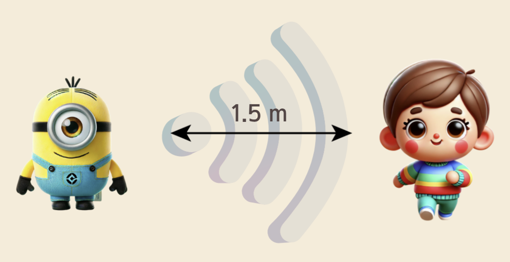
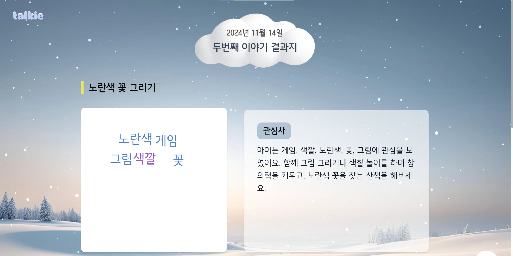
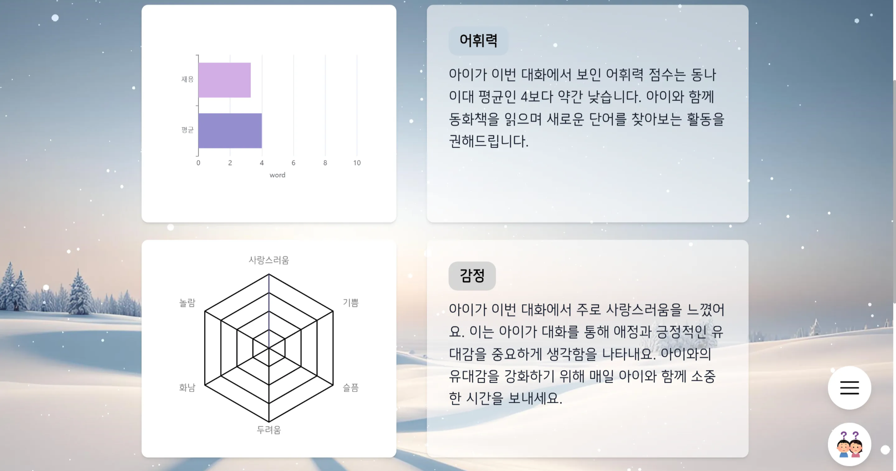
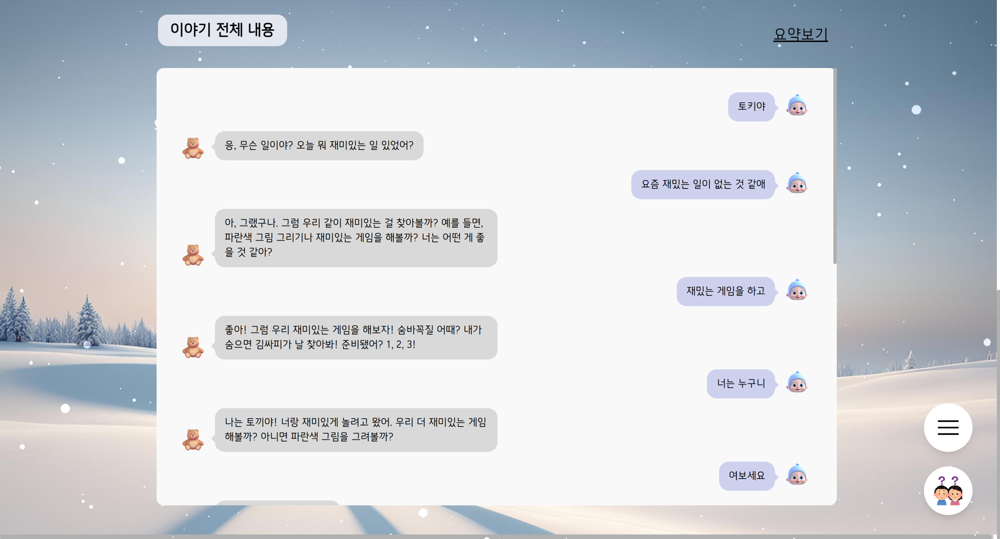
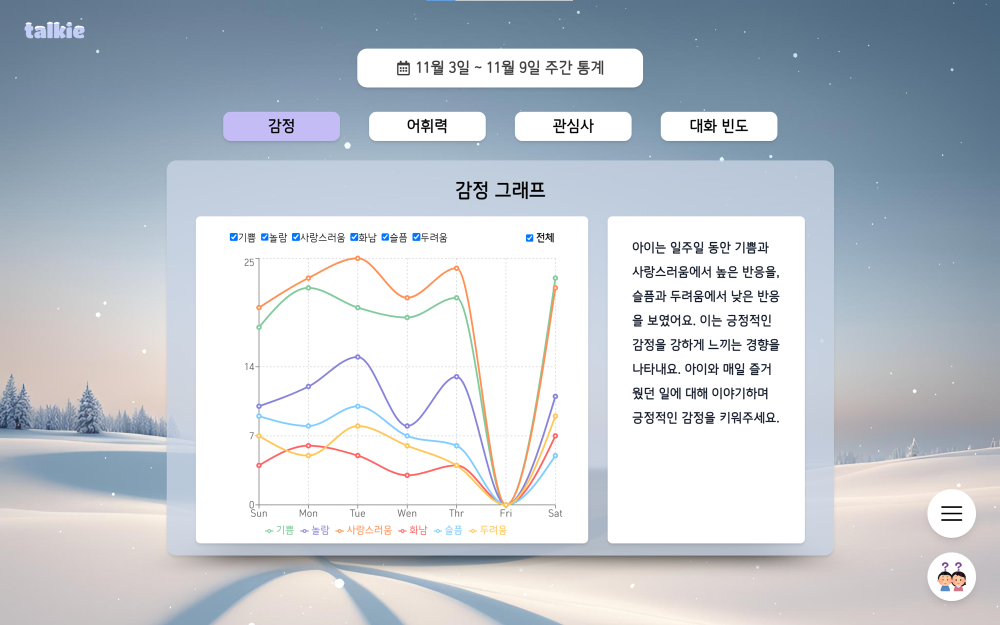
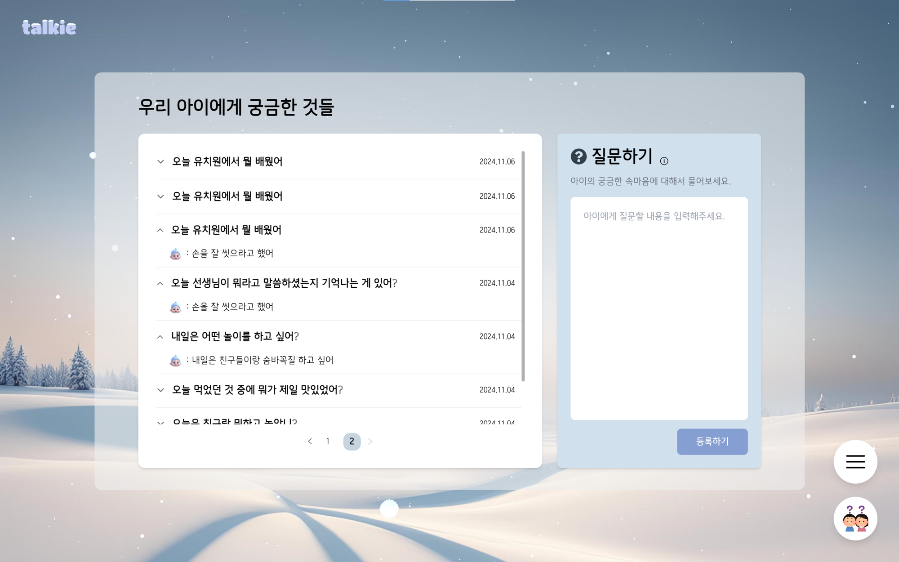
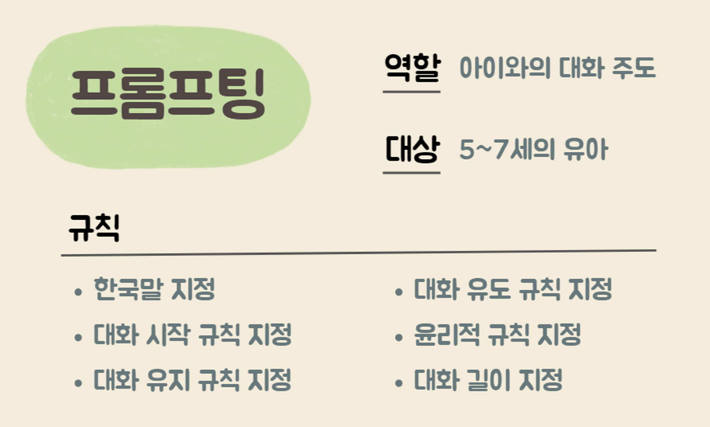
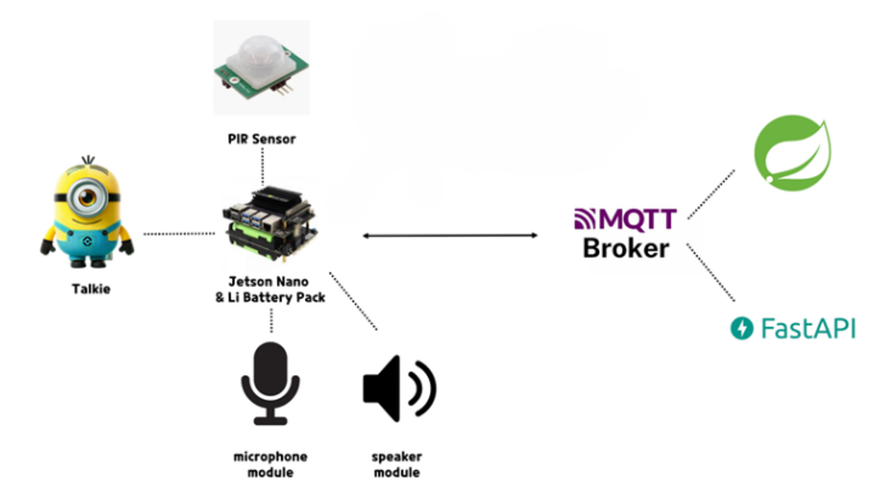
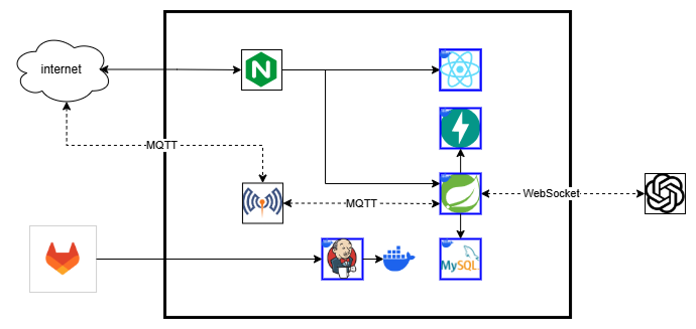

# 🎄 Speak, Connect, Belong : Talkie 🎄🎅

> ***우리 아이의 친구 Talkie*** 
> 자연스러운 대화를 통해 아이의 심리 분석

## 🎁 서비스 소개

사회활동의 시작과 언어, 사고가 본격적으로 발달하는 5세부터 본격적으로 개인적인 고민거리가 생김. 이때 부터 아이들은 자신의 마음을 숨기기 시작함. 

이때 고민들이 적절한 해결방법을 찾지 못했을 때, 이는 곧 유아 우울증으로 이어질 가능성이 높음.

이를 해결하기 위해 아이와 대화를 통해 자연스러운 분위기 속 아이의 고민을 들어줄 수 있는 IoT를 제작함

## 🎁	서비스 목표

1. 아이와 자연스러운 대화로 아이의 고민거리를 파악함
2. 아이의 고민거리를 부모에게 전달하여, 건강한 관계 형성 및 아이의 성장을 도움

## ❄️ Talkie 소개

### 1️⃣ 아이와의 대화

인체를 감지하는 PIR 센서를 활용하여 아이가 인형 정면 1.5m 정도에서 인지가 되면 인형이 인사를 건네며 대화가 시작.

아이가 인형의 이름을 부르면 인형이 적절하게 반응하며 아이와 대화를 시작.

인형은 상황에 맞는 감정 상태와 목소리를 기반으로 대화하며 아이가 자연스럽게 대화할 수 있도록 함.

### 2️⃣ 대화 별 통계

대화 별 통계에서는 아이의 관심사를 요약한 부분을 확인할 수 있음.

또한, 워드클라우드를 통해서 아이의 주요 관심사를 키워드 별로 쉽게 파악할 수 있음.

어휘력 분석은 대화 당 평균 형태소를 기준으로 또래 아이들의 평균과 비교하여 나타냄

감성 분석의 경우 6가지 감정을 분석하여 그래프로 직관적으로 볼 수 있도록 함.

아이와 인형(토키)가 나눈 전체 대화 스크립트를 확인할 수 있으며, 요약보기를 통해 대화 요약도 확인할 수 있음.

### 3️⃣ 주간 통계

주간 통계에서는 한 주간 아이의 대화를 전체적으로 분석 및 요약하여 나타낸 부분을 볼 수 있음

감정 그래프, 어휘력 그래프, 관심사, 대화 빈도를 확인할 수 있음.

### 4️⃣ 부모님의 질문

부모님은 아이의 대화내용 분석 결과를 바탕으로 질문을 작성하고 인형을 통해 비침습적으로 답변을 얻을 수 있음.

## ❄️ Talkie 기술 소개

### (1) 프롬프팅 기반 맞춤형 대화

아이들 맞춤형 대화를 위해 Talkie는 정교한 프롬프팅 기술을 활용
- 아이들 특화 프롬포트: 아이들의 관심사, 연령대, 선호도를 반영한 자연스러운 대화 설계.
- [프롬프트](exec/prompt.md) 보기

### (2) 감정 분석 모델
Talkie는 대화 속 감정을 세밀히 분석하여 더욱 의미있는 분석 결과를 제공
- KOTE 데이터셋 활용: 한국어 감정 분석을 위한 고품질 KOTE 데이터셋을 학습에 사용하여 다양한 감정 상태를 정확히 분류.

### (3) 경량화된 통신 기술
Talkie는 MQTT(Message Queuing Telemetry Transport) 프로토콜을 활용해 경량화된 통신 환경을 구현
- 효율적인 데이터 전송: MQTT는 최소한의 네트워크 대역폭을 사용하며, 작은 크기의 메시지로도 안정적인 데이터 전송을 제공
- 저전력 설계: 경량 프로토콜 특성상 디바이스의 에너지 소비를 줄이는 데 효과적이며, 특히 IoT 환경에서 전력 소모를 최소화

## 🛠 IoT 구성도

## 🛠 시스템 아키텍처

## ⛄ 팀원 소개

### **_Discover the passion and expertise that define our exceptional team_** |  [팀 노션](https://noble-route-3af.notion.site/11f40b016f6981ea9169d426c83a43c3?pvs=4)

|                                     |                                                                                                                                                                   |                                      |                                                                                                                                                                            |
| ----------------------------------- | ----------------------------------------------------------------------------------------------------------------------------------------------------------------- | ------------------------------------ | -------------------------------------------------------------------------------------------------------------------------------------------------------------------------- |
|  | **JaeChan Lee**    Data / Infra   UX / UI 개발   데이터 캐싱 및 서버 비동기 통신   [GitHub](https://github.com/jaechanjj) / Email: jaechanjj@gmail.com     |  | **JiHwan Gong**    Backend   ERD 설계 및 CRUD 구현   Realtime API Socket Client 초기 구현   FastAPI 연동   [GitHub](https://github.com/izgnok) / Email : rinch12332@gmail.com      |
|       | **HaHyul Kim**   Frontend / IoT   UX / UI Customize   Server-Client간 MQTT 통신 구현   [GitHub](https://github.com/busangangster) / Email : gkgbf1034@gmail.com  |            | **Jeongun Seo**   Backend   MQTT 어댑터 작성 및 디버깅   Realtime API Socket Client 리팩토링 및 디버깅   [GitHub](https://github.com/SlowCloud) / Email : sju9417@gmail.com    |
|           | **HyunJeong Cho**   Frontend   UX / UI 디자인 및 개발   웹 성능 최적화   API 데이터 연동   [GitHub](https://github.com/hyunjeongg11) / Email : guswjd4585@gmail.com |              | **JaeYoung Choi**   Infra / IoT   인프라 아키텍처, CI/CD 구축   센서 및 HW 제어 구현   [GitHub nk](https://github.com/wodyddldl333) / Email : wodyddldl333@naver.com |

## 🔔 포팅 메뉴얼

[포팅메뉴얼](exec/Talkie_배포가이드.pdf)을 참고